 

&nbsp;
&nbsp;
&nbsp;

&nbsp;

---

## 🚀 About Me

I'm **Bharat Chejay J**, a **Team Lead** with 8+ years of full-stack and AI engineering. I ship whole platforms: web, mobile, backend, and the Linux boxes they run on.

- 🩺 **Right now:** building [NEET.info](https://neet.info), an AI operating system for NEET preparation and medical counseling. 21 live tools, an AI coach streaming from self-hosted models, and a nightly-synced national directory of **823 medical colleges**, all running on infrastructure I administer myself
- 🧭 **Most recently:** led full-stack delivery at PartyWitty (Mar-Jul 2026), owning **87% of the core backend** and nearly half of all engineering commits across **10 repositories**
- 🤖 **Before that:** 4 years building AI document-intelligence and CRM automation at Nablasol (OCR + GPT-4 pipelines at 95% accuracy, 24M-record scale) and 3.5 years of full-stack delivery at Quantum Leap, where I led the TATA management portal
- 🛠 **I love building:** payment systems, AI pipelines (speech-to-text into LLM summaries), secure Linux infrastructure, and technical SEO that puts real businesses on page one of local search
- 🔐 **Also shipped:** [SlotItUp](https://slotitup.com), a full appointment-booking platform with a Play Store app, plus a zero-dependency encrypted database backup platform and a 46-point infrastructure security overhaul

## 🛠️ Tech Stack

**Languages & Backend**

**Frontend & Mobile**

**AI, Cloud & DevOps**

**Frameworks & Tools**

## 🟢 Live Products

| Product | What it is | Stack |
|---------|------------|-------|
| [**NEET.info**](https://neet.info) | AI operating system for NEET UG prep and medical counseling: AI coach, study planner, mock analysis, rank predictor, seat matrices, cut-off analysis, rank scan, round simulator, choice optimizer and a decision engine, **21 tools in all**, covering AIQ and all 35 state quotas. Every advisory answer explains itself instead of handing down a bare verdict | Next.js · Fastify · TypeScript · PostgreSQL · Redis · Ollama |
| [**SlotItUp**](https://slotitup.com) | Appointment booking for salons, spas, barbers and clinics: a Flutter customer app on the [Play Store](https://play.google.com/store/apps/details?id=com.slotitup.app), a multi-subdomain Next.js web app serving six personas, and a hardened FastAPI backend with TOTP MFA and a commission ledger | Flutter · Next.js · FastAPI · PostgreSQL |
| [**Rudra Dental**](https://rudradental.com) | Freelance build for a Chennai dental clinic: a practice-management backend (appointments, patients, prescriptions, invoices, WhatsApp alerts) behind a local-SEO-first site with Dentist JSON-LD, GA4 and locality-targeted metadata that ranks across its neighborhoods | PHP · MySQL · JSON-LD · GA4 |

## 🏗️ What I Built at PartyWitty

| Area | Highlights |
|------|------------|
| 💳 **Payments** | Unified checkout across **Razorpay, Paytm, Stripe & Easebuzz** with wallet co-funding, webhook firewalling & reward issuance |
| 🧠 **AI Call Intelligence** | Call-center recordings transcribed by **AssemblyAI**, summarized by a **local LLM (Ollama)**, delivered as automated daily reports |
| 💬 **WhatsApp AI Concierge** | Meta Cloud API bot with **Dify AI** conversations, session memory & message queuing |
| 🐧 **Linux Administration** | Production VPS fleet: **Pritunl VPN server, iptables firewalling, Apache vhosts, certbot DNS-01 SSL automation**, Docker hardening, Passbolt and phpMyAdmin rollouts |
| 🔐 **Security & Backups** | 46-point hardening overhaul, VPN-only admin perimeter, **AES-256-GCM encrypted DB backups to Cloudflare R2** with TOTP MFA |
| 📱 **Multi-surface delivery** | One platform across React web, Flutter customer + partner apps, CodeIgniter & Node backends |
| 📊 **Team process** | Trello-synced engineering reports, HRMS with geofence + face-detection attendance |

## 📂 Open Source

| Project | What it does | Stack |
|---------|--------------|-------|
| [pdf-elasticsearch-indexer](https://github.com/bharatcj/pdf-elasticsearch-indexer) ⭐ | Extracts text from PDFs (incl. OCR) and indexes them for instant full-text search | Python · Elasticsearch |
| [sugarcrm-elasticsearch](https://github.com/bharatcj/sugarcrm-elasticsearch) | Custom global-search API for SugarCRM powered by Elasticsearch | PHP · Elasticsearch |
| [airflow-dag-manager](https://github.com/bharatcj/airflow-dag-manager) | Generates and manages dynamic DAGs in Apache Airflow | Python · Airflow |
| [gcp-speech-transcriber](https://github.com/bharatcj/gcp-speech-transcriber) | Transcribes audio in Google Cloud Storage via Speech-to-Text | Python · GCP |
| [ocr-text-extractor](https://github.com/bharatcj/ocr-text-extractor) | Extracts text from images & PDFs using EasyOCR | Python · EasyOCR |
| [youtube-bulk-uploader](https://github.com/bharatcj/youtube-bulk-uploader) | Resumable, retrying, playlist-aware bulk YouTube uploads | Python · YouTube API |
| [sugarcrm-api-security-hook](https://github.com/bharatcj/sugarcrm-api-security-hook) | Security-focused logic hook for monitoring API access in SugarCRM | PHP |
| [google-signature-updater](https://github.com/bharatcj/google-signature-updater) | Automates email-signature rollouts across Google Workspace | Python · Workspace API |

## 📊 GitHub Stats

## 🤝 Let's Connect

🌐 [bharatcj.tech](https://bharatcj.tech) · 💼 [LinkedIn](https://www.linkedin.com/in/bharat-cj/) · 📧 [bharatchijay@gmail.com](mailto:bharatchijay@gmail.com) · 🐙 [GitHub](https://github.com/bharatcj)

*Open to collaborations in AI, automation, and platform engineering.*

